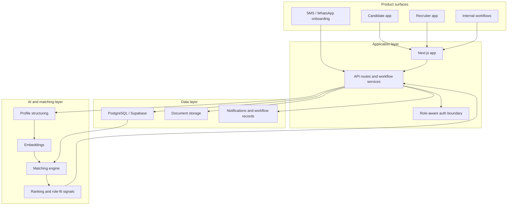
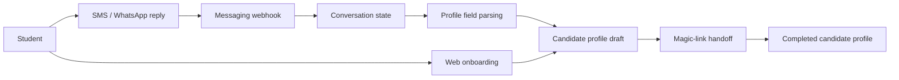
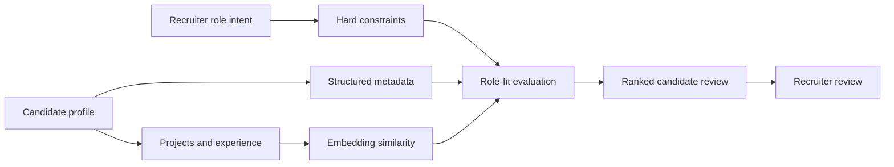
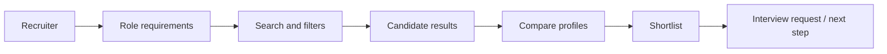

# CacheAI Case Study

> AI recruitment platform that turns student work into structured candidate profiles and helps recruiters discover talent through evidence-based search and AI-assisted matching.

<p align="center">
  <a href="https://cacheai.us">
    
  </a>
  <a href="#platform-architecture">
    
  </a>
  <a href="#matching-engine">
    
  </a>
</p>

<p align="center">
  
</p>

<p align="center">
  <a href="#overview">Overview</a> •
  <a href="#engineering-contributions">Engineering Contributions</a> •
  <a href="#platform-architecture">Architecture</a> •
  <a href="#candidate-onboarding">Onboarding</a> •
  <a href="#matching-engine">Matching</a> •
  <a href="#recruiter-workflows">Recruiters</a> •
  <a href="#case-study-docs">Docs</a>
</p>

---

## Overview

CacheAI helps students turn projects, experience, resumes, skills, and profile data into structured recruiting profiles. Recruiters can search, filter, compare, and evaluate candidates based on evidence of what they have built, not just resume keywords.

This repository is a public engineering case study for a private production codebase. It documents the architecture, product flows, and engineering decisions behind CacheAI without exposing production source code, private user data, exact matching formulas, prompts, credentials, or internal business details.

> **TODO:** Add a hero screenshot of the CacheAI landing page, candidate profile, or recruiter dashboard here.
> Suggested path: `docs/images/cacheai-hero.png`

---

## Engineering Contributions

**Role:** Co-Founder & CTO

I have worked across the product and engineering stack for CacheAI, including candidate onboarding, recruiter workflows, matching, auth, database design, AI-assisted profile structuring, messaging, and internal documentation.

### What I built

* Designed the candidate profile system for projects, experience, resumes, documents, skills, and structured recruiting metadata
* Built recruiter workflows for search, filtering, candidate review, shortlists, interview requests, profile sharing, and pipeline-style evaluation
* Engineered the matching workflow using structured profile fields, recruiter-defined constraints, project evidence, skill metadata, and embedding-based similarity
* Built web and messaging-based onboarding flows using webhooks, conversation state, parsing logic, and magic-link handoff
* Implemented role-aware auth and routing across candidate, recruiter, and internal/admin-style workflows
* Designed Supabase/PostgreSQL data models for candidates, recruiters, documents, skills, interviews, notifications, profile shares, and recruiter actions
* Debugged production auth/session behavior across frontend state, middleware, backend APIs, and Supabase event flows
* Created internal repo documentation, workflow maps, onboarding guides, and safe task boundaries for teammates and interns

---

## Platform Architecture

CacheAI is built around a simple product boundary: candidates contribute structured evidence of their work, and recruiters evaluate that evidence through controlled search and matching workflows.



> **TODO:** Add an architecture screenshot or product dashboard screenshot here.
> Suggested path: `docs/images/platform-architecture.png`

---

## Candidate Onboarding

One of the main product challenges was reducing the friction between “student has experience” and “student has a structured recruiting profile.”

CacheAI supports onboarding through both the web product and messaging-style entrypoints. The messaging flow is designed to collect profile information progressively, maintain conversation state, and hand users into the authenticated web experience through magic links.



### What this supports

* Lower-friction student onboarding
* Conversation-based profile collection
* Incremental profile drafting
* Webhook-driven state management
* Magic-link handoff into the main web app
* Better conversion from initial student interest to completed profile

> **TODO:** Add a screenshot of the SMS/WhatsApp onboarding flow here.
> Suggested path: `docs/images/messaging-onboarding.png`

---

## Matching Engine

CacheAI’s matching system is designed around recruiter intent, not generic resume ranking.

The system combines structured profile data, hard constraints, skills, project evidence, and semantic similarity. Exact formulas, prompts, weights, thresholds, and scoring logic are intentionally excluded from this public case study.



### Matching signals

| Signal                  | Purpose                                                                |
| ----------------------- | ---------------------------------------------------------------------- |
| Hard constraints        | Keeps required recruiter criteria separate from softer fit signals     |
| Structured profile data | Supports reliable filtering and comparison                             |
| Project evidence        | Shows what a student has actually built                                |
| Skill metadata          | Supports exact and related skill matching                              |
| Embeddings              | Adds semantic similarity across projects, experience, and role context |
| Recruiter review        | Keeps final evaluation with the human decision-maker                   |

> **TODO:** Add a screenshot of recruiter search or ranked candidate review here.
> Suggested path: `docs/images/matching-results.png`

---

## Recruiter Workflows

The recruiter side of CacheAI is built to help teams move from role requirements to candidate review quickly.

Recruiters can search across structured candidate records, evaluate project evidence, compare candidates, shortlist profiles, and move candidates toward interview workflows.



### Workflow areas

* Candidate search and filtering
* Ranked candidate review
* Profile comparison
* Shortlist and pipeline-style tracking
* Interview request workflows
* Notifications and recruiter actions
* Shared profile views

> **TODO:** Add a screenshot of recruiter search, shortlist, or candidate profile review here.
> Suggested path: `docs/images/recruiter-workflow.png`

---

## Tech Stack

| Area           | Tools                                                                         |
| -------------- | ----------------------------------------------------------------------------- |
| Frontend       | Next.js, React, TypeScript                                                    |
| Backend        | Node.js, Next.js API routes                                                   |
| Database       | PostgreSQL, Supabase                                                          |
| Auth           | Supabase Auth, role-aware routing, magic links                                |
| AI             | Azure OpenAI, embeddings, AI-assisted profile structuring, matching workflows |
| Storage        | Supabase Storage / object storage patterns                                    |
| Messaging      | Webhooks, SMS/WhatsApp-style onboarding                                       |
| Infrastructure | Docker, cloud deployment patterns                                             |
| Documentation  | Architecture docs, workflow maps, onboarding guides                           |

---

## Engineering Challenges

Some of the most interesting engineering problems behind CacheAI were not just feature work. They were product-system problems.

* Designing a matching workflow that combines deterministic filters with semantic retrieval without turning recruiter review into a black box
* Structuring highly variable student experience into consistent candidate records
* Keeping candidate, recruiter, and internal workflows separated through role-aware auth and routing
* Building messaging onboarding that can collect useful profile data without forcing a long form up front
* Debugging auth/session behavior across frontend state, middleware, backend APIs, and Supabase event flows
* Documenting enough of the platform for contributors to move quickly without exposing sensitive implementation details

---

## Case Study Docs

| Area                   | Link                                                             |
| ---------------------- | ---------------------------------------------------------------- |
| Platform architecture  | [docs/architecture.md](docs/architecture.md)                     |
| Matching engine        | [docs/matching-engine.md](docs/matching-engine.md)               |
| Candidate onboarding   | [docs/onboarding.md](docs/onboarding.md)                         |
| Recruiter workflows    | [docs/recruiter-workflows.md](docs/recruiter-workflows.md)       |
| Engineering challenges | [docs/engineering-challenges.md](docs/engineering-challenges.md) |
| Security note          | [SECURITY_NOTE.md](SECURITY_NOTE.md)                             |

> **TODO:** If these docs do not exist yet, either create them or update the links to match the current filenames.

---

## Suggested Repository Structure

```text
cache-case-study/
├── README.md
├── SECURITY_NOTE.md
├── docs/
│   ├── architecture.md
│   ├── matching-engine.md
│   ├── onboarding.md
│   ├── recruiter-workflows.md
│   ├── engineering-challenges.md
│   └── images/
│       ├── cacheai-hero.png
│       ├── platform-architecture.png
│       ├── messaging-onboarding.png
│       ├── matching-results.png
│       └── recruiter-workflow.png
└── diagrams/
    ├── system-architecture.mmd
    ├── matching-engine.mmd
    └── onboarding-flow.mmd
```

---

## What Is Intentionally Excluded

This public case study does not include:

* Production source code
* Private student, recruiter, company, or partner data
* Credentials, keys, tokens, `.env` values, or production URLs
* Exact API route implementations
* Full production database schemas
* Proprietary prompts
* Exact matching formulas, scoring weights, thresholds, or ranking logic
* Internal pricing, roadmap, customer details, or confidential business information

---

## Future Work

Areas I would continue improving:

* Ranking explainability for recruiter-facing candidate results
* Search quality analytics for recruiter behavior and candidate conversion
* Admin QA tools for reviewing profile quality and match quality
* More structured evaluation sets for matching behavior
* Stronger observability around onboarding drop-off and auth/session behavior
* Cleaner analytics around recruiter actions, shortlist behavior, and interview conversion

---

## Note

This repository is a public case study for a private production codebase. Diagrams, screenshots, and examples are simplified to show engineering approach without exposing sensitive implementation details.
