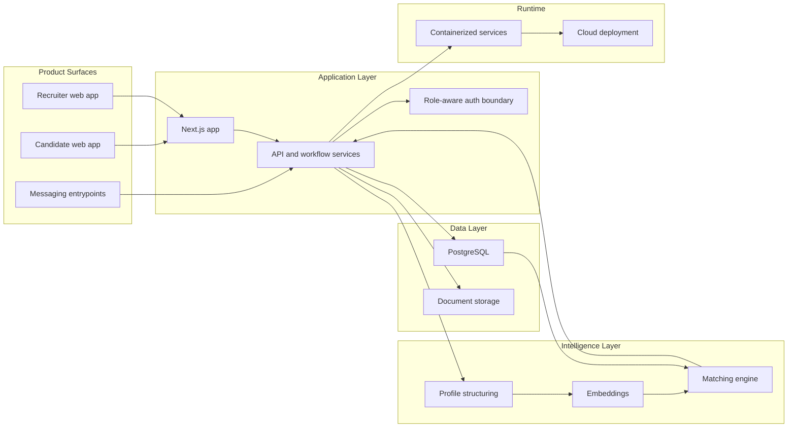
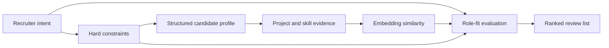

# CacheAI Case Study

AI recruitment platform for structured student profiles, recruiter search, and candidate matching.

CacheAI turns student projects, experience, skills, and profile data into structured recruiting records. Recruiters use that structured evidence to search, compare, and evaluate candidates at a higher signal level than a resume-only workflow. This public repo is a case study of the architecture and product engineering approach, not the production codebase.

## Role

Co-Founder & CTO. I worked across product architecture, full-stack engineering, matching systems, role-based platform design, and technical documentation.

## Stack

## Architecture At A Glance

## Matching Engine Overview

The matching architecture combines structured profile fields, role constraints, project evidence, skill signals, and embedding-based similarity. Exact scoring formulas, weights, prompts, and implementation details are intentionally excluded.

## Case Study Docs

| Area | Link |
| --- | --- |
| Platform architecture | [docs/architecture.md](docs/architecture.md) |
| Matching engine | [docs/candidate-matching.md](docs/candidate-matching.md) |
| Technical decisions | [docs/technical-decisions.md](docs/technical-decisions.md) |
| Security note | [SECURITY_NOTE.md](SECURITY_NOTE.md) |

## Diagrams

| Diagram | Focus |
| --- | --- |
| [System architecture](diagrams/system-architecture.mmd) | Product surfaces, app layer, data, AI, and runtime boundaries. |
| [Tech stack map](diagrams/tech-stack-map.mmd) | Technology groups used across the platform. |
| [Matching engine](diagrams/matching-engine.mmd) | High-level candidate matching pipeline. |
| [Recruiter evaluation loop](diagrams/recruiter-evaluation-loop.mmd) | Conceptual search, review, and pipeline loop. |
| [Data boundaries](diagrams/data-boundaries.mmd) | Separation between candidate data, recruiter actions, auth, data stores, and AI services. |
| [Deployment runtime](diagrams/deployment-runtime.mmd) | Public-safe runtime view without production infrastructure details. |

## What I Built

- System architecture for a role-separated AI recruitment platform.
- Candidate profile structuring from projects, skills, experience, and documents.
- Recruiter search and evaluation workflows backed by structured candidate records.
- Matching architecture using hard constraints, metadata signals, and embeddings.
- Public-safe architecture documentation for a private production codebase.

## Intentionally Excluded

This case study excludes production source code, private user data, credentials, production URLs, full database schemas, exact API routes, proprietary prompts, exact ranking formulas, scoring weights, internal logs, private partner details, pricing configuration, and confidential roadmap material.

## Technology Sources

| Technology | Official source |
| --- | --- |
| Next.js | [nextjs.org](https://nextjs.org/) |
| React | [react.dev](https://react.dev/) |
| TypeScript | [typescriptlang.org](https://www.typescriptlang.org/) |
| Supabase | [supabase.com](https://supabase.com/) |
| PostgreSQL | [postgresql.org](https://www.postgresql.org/) |
| Azure AI | [azure.microsoft.com/products/ai-services](https://azure.microsoft.com/products/ai-services) |
| OpenAI | [openai.com](https://openai.com/) |
| Twilio | [twilio.com](https://www.twilio.com/) |
| Docker | [docker.com](https://www.docker.com/) |
