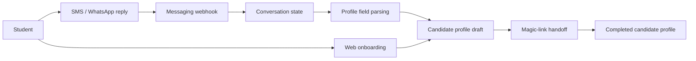
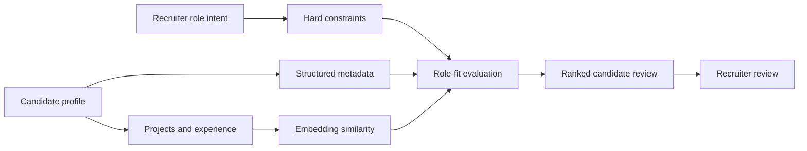
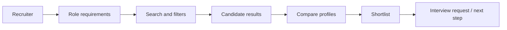

# Cache Case Study - Sujay Chava

> AI recruitment platform that turns student work into structured candidate profiles and helps recruiters discover talent through evidence-based search and AI-assisted matching.

  
  
  

  <a href="#overview">Overview</a> •
  <a href="#engineering-contributions">Engineering Contributions</a> •
  <a href="#platform-architecture">Architecture</a> •
  <a href="#candidate-onboarding">Onboarding</a> •
  <a href="#matching-engine">Matching</a> •
  <a href="#recruiter-workflows">Recruiters</a> •
  <a href="#case-study-docs">Docs</a>

---

## Overview

Cache helps students turn projects, experience, resumes, skills, and profile data into structured recruiting profiles. Recruiters can search, filter, compare, and evaluate candidates based on evidence of what they have built, not just resume keywords.

This repository is a public engineering case study for a private production codebase. It documents the product architecture, core workflows, and engineering decisions behind Cache without any production source code, private user data, exact matching formulas, prompts, credentials, or internal business details.

---

## Engineering Contributions

**Role:** Co-Founder & CTO

I have worked across the product and engineering stack for Cache, including candidate onboarding, recruiter workflows, matching, auth, database design, AI-assisted profile structuring, messaging, and internal documentation.

### What I built

* Designed the candidate profile system for projects, experience, resumes, documents, skills, and structured recruiting metadata
* Built recruiter workflows for search, filtering, candidate review, shortlists, interview requests, profile sharing, and pipeline-style evaluation
* Engineered the matching workflow using structured profile fields, recruiter-defined constraints, project evidence, skill metadata, and embedding-based similarity
* Built web and messaging-based onboarding flows using webhooks, conversation state, parsing logic, and magic-link handoff
* Implemented role-aware auth and routing across candidate, recruiter, and internal/admin-style workflows
* Designed Supabase/PostgreSQL data models for candidates, recruiters, documents, skills, interviews, notifications, profile shares, and recruiter actions
* Debugged production auth/session behavior across frontend state, middleware, backend APIs, and Supabase event flows
* Created internal repo documentation, workflow maps, onboarding guides, and safe task boundaries for teammates and interns

---

## Platform Architecture

Cache is built around a simple product boundary: students contribute structured evidence of their work in a profile, and recruiters evaluate that evidence through controlled search, matching, and review workflows.

  

The public architecture view focuses on system shape, not implementation detail. It shows how student onboarding, structured profiles, recruiter search, role-aware auth, messaging, storage, and matching connect at a high level.

### Core platform areas

| Area                 | What it handles                                                                                 |
| -------------------- | ----------------------------------------------------------------------------------------------- |
| Candidate app        | Profile creation, project evidence, resumes, skills, and student-facing workflows               |
| Recruiter app        | Search, filters, candidate review, shortlists, interview requests, and pipeline workflows       |
| Messaging onboarding | SMS/WhatsApp-style entrypoints, webhooks, conversation state, parsing, and magic-link handoff   |
| API/workflow layer   | Product logic, orchestration, role checks, and backend workflow coordination                    |
| Data layer           | Candidate profiles, recruiter actions, documents, notifications, interviews, and profile shares |
| AI/matching layer    | Profile structuring, embeddings, semantic similarity, matching, and role-fit signals            |

---

## Candidate Onboarding

One of the main product challenges was reducing the friction between “student has experience” and “student has a structured recruiting profile.”

Cache supports onboarding through both the web product and messaging-style entrypoints. The messaging flow is designed to collect profile information progressively, maintain conversation state, and hand users into the authenticated web experience through magic links.

### What this supports

* Lower-friction student onboarding
* Conversation-based profile collection
* Incremental profile drafting
* Webhook-driven state management
* Magic-link handoff into the main web app
* Better conversion from initial student interest to completed profile

---

## Matching Engine

Cache’s matching system is designed around recruiter intent, not generic resume ranking.

The system combines structured profile data, hard constraints, skills, project evidence, and semantic similarity. Exact formulas, prompts, weights, thresholds, and scoring logic are intentionally excluded from this public case study.

### Matching signals

| Signal                  | Purpose                                                                |
| ----------------------- | ---------------------------------------------------------------------- |
| Hard constraints        | Keeps required recruiter criteria separate from softer fit signals     |
| Structured profile data | Supports reliable filtering and comparison                             |
| Project evidence        | Shows what a student has actually built                                |
| Skill metadata          | Supports exact and related skill matching                              |
| Embeddings              | Adds semantic similarity across projects, experience, and role context |
| Recruiter review        | Keeps final evaluation with the human decision-maker                   |

---

## Recruiter Workflows

The recruiter side of Cache is built to help teams move from role requirements to candidate review quickly.

Recruiters can search across structured candidate records, evaluate project evidence, compare candidates, shortlist profiles, and move candidates toward interview workflows.

### Workflow areas

* Candidate search and filtering
* Ranked candidate review
* Profile comparison
* Shortlist and pipeline-style tracking
* Interview request workflows
* Notifications and recruiter actions
* Shared profile views

---

## Tech Stack

The architecture image above includes the core stack visually. This table gives the full breakdown.

| Area           | Tools                                                                         |
| -------------- | ----------------------------------------------------------------------------- |
| Frontend       | Next.js, React, TypeScript                                                    |
| Backend        | Node.js, Next.js API routes                                                   |
| Database       | PostgreSQL, Supabase                                                          |
| Auth           | Supabase Auth, role-aware routing, magic links                                |
| AI             | Azure OpenAI, embeddings, AI-assisted profile structuring, matching workflows |
| Storage        | Supabase Storage / object storage patterns                                    |
| Messaging      | Webhooks, SMS/WhatsApp-style onboarding                                       |
| Infrastructure | Docker, cloud deployment patterns                                             |
| Documentation  | Architecture docs, workflow maps, onboarding guides                           |

---

## Engineering Challenges

Some of the most interesting engineering problems behind Cache were not just feature work. They were product-system problems.

* Designing a matching workflow that combines deterministic filters with semantic retrieval without turning recruiter review into a black box
* Structuring highly variable student experience into consistent candidate records
* Keeping candidate, recruiter, and internal workflows separated through role-aware auth and routing
* Building messaging onboarding that can collect useful profile data without forcing a long form up front
* Debugging auth/session behavior across frontend state, middleware, backend APIs, and Supabase event flows
* Documenting enough of the platform for contributors to move quickly without exposing sensitive implementation details

---

## Note

This repository is a public case study for a private production codebase. Diagrams, screenshots, and examples are simplified to show engineering approach without exposing sensitive implementation details.

ALl screenshots use demo data and examples. No real candidate, recruiter, company, resume, or partner data is shown (other than my profile).
