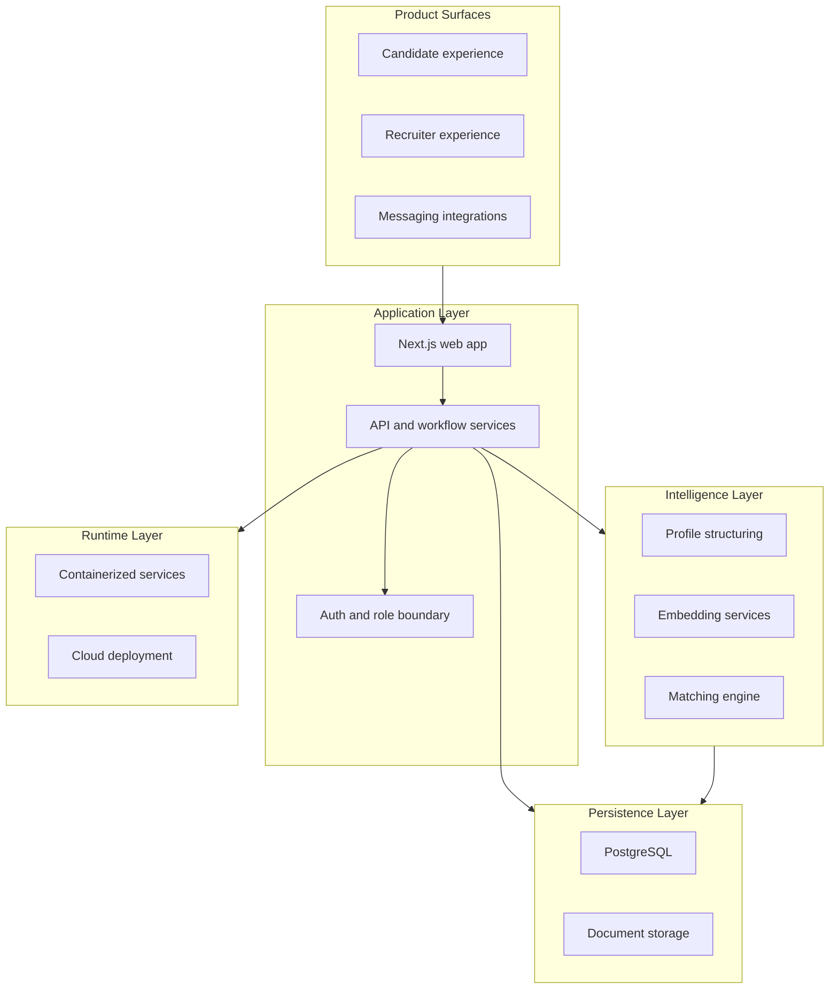
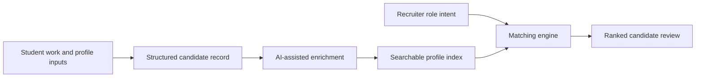

# Platform Architecture

CacheAI is an AI recruitment platform built around a simple system boundary: candidates contribute structured evidence of their work, and recruiters evaluate that evidence through controlled search and matching workflows.

This document describes the architecture at a public-safe level. It does not include production source code, exact routes, full schemas, secrets, prompts, or scoring logic.

## Architecture Layers

See also: [system-architecture.mmd](../diagrams/system-architecture.mmd), [tech-stack-map.mmd](../diagrams/tech-stack-map.mmd), and [deployment-runtime.mmd](../diagrams/deployment-runtime.mmd).

## Component Map

| Layer | Purpose | Public-safe technologies |
| --- | --- | --- |
| Product surfaces | Candidate and recruiter experiences, plus lightweight messaging entrypoints. | Next.js, React, messaging webhooks |
| Application layer | Coordinates workflows, permissions, and service boundaries. | Next.js API layer, Node.js |
| Auth boundary | Keeps candidate and recruiter access separated. | Supabase Auth, server-side role checks |
| Data layer | Stores structured recruiting data and documents. | PostgreSQL, Supabase, object storage patterns |
| Intelligence layer | Structures profile evidence and supports semantic matching. | Embeddings, AI-assisted parsing, matching services |
| Runtime layer | Runs the web app and supporting services. | Containers, cloud deployment patterns |

## System Design Goals

- Preserve candidate and recruiter separation throughout the platform.
- Turn unstructured student work into structured, searchable recruiting records.
- Combine deterministic filters with semantic matching rather than relying on one method.
- Keep sensitive logic behind server-side boundaries.
- Make the architecture explainable without exposing product-copyable details.

## Public-Safe Data Flow

## What Is Abstracted

The public architecture intentionally abstracts implementation details that would make the production system easier to copy or attack: exact schemas, privileged service boundaries, API route shapes, prompts, vendor configuration, ranking weights, and operational runbooks.
