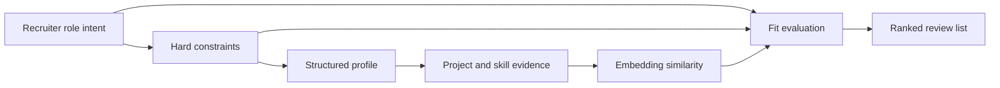

# Matching Engine

CacheAI's matching engine is designed to help recruiters evaluate candidates from evidence: projects, skills, experience, and structured profile data.

This page stays at the architecture level. It does not include scoring formulas, weights, prompts, exact schemas, private candidate examples, or implementation-level route details.

## High-Level Pipeline

Standalone diagram: [matching-engine.mmd](../diagrams/matching-engine.mmd)

## Signal Groups

| Signal group | Role in matching |
| --- | --- |
| Structured profile data | Gives the system reliable fields for filtering and comparison. |
| Project evidence | Adds proof-of-work context beyond resume keywords. |
| Skill metadata | Supports both exact matching and broader role-fit evaluation. |
| Hard constraints | Keeps non-negotiable recruiter requirements separate from softer fit signals. |
| Embeddings | Adds semantic similarity where text and project descriptions matter. |
| Human review loop | Keeps final evaluation with the recruiter instead of presenting ranking as absolute truth. |

## Architecture Principles

- Keep hard constraints explicit and separate from fuzzy fit.
- Use embeddings as one signal, not the whole system.
- Prefer explainable candidate review over black-box automation.
- Support sparse or incomplete profiles without overclaiming certainty.
- Avoid exposing private candidate details or proprietary ranking behavior.

## Excluded Details

Exact score components, weights, thresholds, normalization rules, prompts, route names, and production data examples are intentionally excluded from this public case study.
